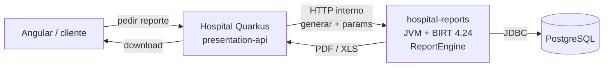

# BIRT en el destino: versión, aislamiento e infra

**Decisión:** conservar los 408 `.rptdesign`, **actualizar el runtime a Eclipse BIRT 4.24**, y **no** embeberlo en el ClassLoader de Quarkus 3 Hospital. El motor corre en un **proceso JVM aparte** (servicio de reportes).

Relacionado: [`dossier-migracion.md`](dossier-migracion.md) §5.6 · decisión 2026-08-14 (aislamiento ClassLoader).

---

## 1. ¿Nueva versión o la del legacy?

| Hoy (legacy) | Destino |
|---|---|
| **4.2.1** (2012) en AGH / AGI / AGP | **Eclipse BIRT 4.24.0** (junio 2026) |
| **4.5.0** (2015) en HOSPITAL_2, HOS-APP, etc. | Misma línea oficial, unificada |

**No nos quedamos en 4.2.1 / 4.5.** Esas versiones están fuera de soporte, exigen Java antiguo y no son un destino razonable junto a Quarkus 3 / JDK 21.

**Sí actualizamos a 4.24**, no reemplazamos el motor por Jasper u otro. Los diseños (`.rptdesign` + JS) se conservan; el trabajo duro es el **SQL Oracle → PostgreSQL** dentro de esos diseños (283 de 408), no rehacer maquetas.

### Qué *no* implica “pasar a 4.24”

- No implica meter BIRT en el `pom` del Hospital Quarkus.
- No implica usar el **BIRT Viewer** (WAR/servlets Tomcat) como producto destino. Hospital hoy usa **Report Engine API** (`new ReportEngine(config)`), y el destino sigue ese modelo: generar PDF/XLS por API, no un portal de diseño.
- El PR oficial de febrero 2026 ([eclipse-birt/birt#2360](https://github.com/eclipse-birt/birt/pull/2360)) migró a `jakarta.*` sobre todo el **viewer**. El engine y bundles Eclipse pueden seguir mixtos: por eso el aislamiento de proceso es obligatorio aunque la versión sea 4.24.

---

## 2. Por qué no va dentro de Quarkus Hospital

Quarkus 3 exige Jakarta EE 10 (`jakarta.*`). Meter el engine (aunque sea 4.24 o un fork “Java 17+”) en el mismo ClassLoader choca con:

- namespace / dependencias residuales `javax.*`
- Hibernate ORM 6, Vert.x, Apache POI, logging, reflexión, motor JS de expresiones

Además **BIRT no compila a imagen nativa GraalVM**. Quarkus Hospital puede seguir JVM; el motor de reportes **sí o sí** queda fuera de cualquier build nativo.

Conclusión: **proceso (y preferentemente deploy) aparte**, no “módulo Maven dentro del mismo jar”.

---

## 3. Implicancia de infra: ¿otro server?

### Respuesta corta

No hace falta un “servidor BIRT” clásico (Tomcat + Viewer). Hace falta **otro proceso Java** que exponga algo mínimo: “generá este `.rptdesign` con estos parámetros → PDF/XLS”.

Ese proceso puede vivir:

| Opción | Qué es | Cuándo |
|---|---|---|
| **A — Sidecar / mismo host, otro contenedor** | Contenedor `hospital-reports` al lado de `hospital-api` | Default recomendado (dev, UAT, prod inicial) |
| **B — Nodo o VM dedicada** | Misma imagen, más CPU/RAM, cola de trabajos | Si el volumen de PDF satura el host del API |
| **C — Embebido en Quarkus** | JARs BIRT en el `pom` del Hospital | **Descartado** (ClassLoader + nativo) |

En la práctica: **otro deploy unit**, no necesariamente otra máquina física el día uno.

### Qué despliega ops

1. **Imagen / servicio `hospital-reports`**
   - JDK 21 (JVM, no nativo)
   - Runtime BIRT 4.24 + emitters (PDF, Excel/POI según hoy)
   - Catálogo de `.rptdesign` (volumen o artefacto versionado)
   - JDBC a PostgreSQL (mismas vistas/funciones de compatibilidad que usarán los reportes)
   - Endpoint interno (mTLS o red privada): p. ej. `POST /reports/run` → stream o URL firmada
2. **Hospital Quarkus**
   - No incluye `org.eclipse.birt.*`
   - Cliente HTTP al servicio de reportes + auth de usuario ya resuelta (JWT / permisos)
3. **Identity**
   - Sin cambio: el usuario autenticado llega al Hospital; el sidecar confía en la red interna o en un token de servicio

### Recursos orientativos (orden de magnitud)

- El engine es pesado al arrancar (extensiones, JS). Una instancia estable + cola es mejor que muchos cold starts.
- CPU/RAM: más exigente que un API REST típico al renderizar PDF grandes; dimensionar por picos de impresión, no por RPS del API clínico.
- Disco: diseños + fonts + temporales de render; no es el volumen de la BD.

### Qué *no* levantar

- No hace falta el **BIRT Designer** en servidores (solo en puestos de quien mantenga diseños, si aplica).
- No hace falta Tomcat 7/10 solo “porque BIRT”: el destino es un proceso thin alrededor del Report Engine, no el WAR Viewer legacy.

---

## 4. Plan a seguir (frente reportes)

Orden alineado al dossier: BIRT **no manda el día a día**; sí condiciona el **corte** cuando haya que imprimir desde el stack nuevo.

| Paso | Qué | Criterio de hecho |
|---|---|---|
| **R0** | Spike: BIRT 4.24 + 3–5 `.rptdesign` críticos en JVM aislada (fuera de Quarkus) | PDF generados; lista de choques de deps |
| **R1** | Diff de los 3 parches internos (`ResourceLocatorWrapper`, `PageDeviceRender`, `DataSourceQuery`) vs fuente 4.5 / 4.24 | Sabemos si reaplicar, upstream o drop |
| **R2** | Verificar `com.onbarcode.barcode.birt` 2.2.1 vs 4.24 + licencia | Barcodes OK o plan B |
| **R3** | Esqueleto `hospital-reports` (API mínima + health + un reporte) | **Hecho (G1-d + G1-d.birt)** — BIRT 4.24 worker + `NroColaEsperaRecep` adaptado PG |
| **R3.1** | **Paridad ticket AGI** (`NroColaEsperaRecep`): logo real, barcode, look vs legacy | **Hecho en código (2026-08-14)** — logo GEA/Materdei, font DANI 2of5, `codBarra` vía `Interleaved25Encoder`; **UAT impresora física = on-site** (ver §4.1) |
| **R3.2** | **Harness de testing BIRT real** (opt-in) | **Hecho** — `BIRT_IT=true` + runtime BIRT (worker) + base PG real; valida render, `%PDF`, texto y logo/barcode por reporte |
| **R3.3** | **Refactor `generic-report-engine`** (motor genérico desacoplado de `NroColaEsperaRecep`) | **Hecho y commiteado (2026-08-26)** — habilitador de R5; Hospital-Reports `dev/dev` |
| **R3.4** | **PoC AWS ECS Fargate** (imagen + task pública) | **Hecho (2026-08-25)** — health UP + PDF BIRT real; ver [`despliegue-hospital-reports-aws.md`](despliegue-hospital-reports-aws.md) |
| **R4** | Capa PG de helpers BIRT (PERSONAS/GENERAL; ver hallazgos VPN) | SQL de diseños deja de depender de fantasmas Oracle |
| **R5** | Migración SQL de datasets en `.rptdesign` (283 con dialecto Oracle), por oleadas CU | **Oleada 1 (HC+EpicrisisGYE): dialect + scaffold** — gaps packages/TMP: [`sdd/r5-historia-clinica-epicurisis-gye/`](../cortes/plataforma/r5-historia-clinica-epicurisis-gye/) · Guía: [`sdd/register-report-sidecar.md`](register-report-sidecar.md) |
| **R6** | Hospital Quarkus: endpoints de “solicitar reporte” → cliente al sidecar | Angular solo descarga/imprime |
| **R7** | UAT aislado → corte | Paridad de salida vs legacy en muestra pactada |

Snapshot consolidado: [`sdd/sidecar-reports-avance.md`](../estado/sidecar-reports-avance.md).

### 4.1 Deuda obligatoria — ticket cola recepción (no olvidar)

G1-d.birt validó el motor; **R3.1 (ingeniería)** cerró logo + barcode + params (2026-08-14).

| Ítem | Estado | Criterio de hecho | Notas |
|------|--------|-------------------|-------|
| **Logo real** | **Hecho** | PDF con `logo_prt_small_GEA.png` (o MATERDEI) vía `urlLogoSmall` | Assets en `Hospital-Reports/assets/logos/` |
| **Barcode** | **Hecho (recepción)** | Glyphs `DANI 2of5` + `Interleaved25Encoder` sobre nro espera | No OnBarcode. Triage (`f_cod_barra_triage_amb`) cuando exista CU triage |
| **Pixel / layout** | **Parcial** | Diseño legacy restaurado (image + tipografía) | Ajuste fino vs PDF legacy en UAT |
| **Impresora térmica** | **Pendiente on-site** | Ticket impreso legible en impresora del tótem | No automatizable desde este entorno |

**Regla:** no declarar “tótem listo para corte” sin **UAT impresora** (o WAIVER firmado por negocio).

Track: SDD [`sdd/piloto-agi-g1-d-birt/`](../cortes/recepcion/piloto-agi-g1-d-birt/) · backlog [`sdd/backlog-orden-2026-08-14.md`](../planificacion/backlog-orden-2026-08-14.md).

**Fuera de alcance del día a día del piloto AGI/ANUNCIADOR (features nuevas):** no bloquea el siguiente CU clínico; **sí** bloquea el corte de impresión del ticket hasta UAT impresora.

### 4.2 Harness de testing BIRT real y refactor de motor genérico

**R3.2 — Harness de testing BIRT real (HECHO).** Infraestructura construida en el sidecar para validar reportes contra el motor real (no solo OpenPDF) y una base PostgreSQL real:

- **Opt-in:** `BIRT_IT=true` + runtime BIRT descargado (worker) + credenciales DB por env. `mvn test` corre los IT OpenPDF y **skippea** los BIRT reales.
- **Components (sidecar):** `Hospital-Reports/src/test/java/.../birtit/*` (`BirtEnv`, `ReflectiveBirtInvoker`, `BirtTestHarness`, `AbstractBirtRenderIT`, `NroColaEsperaRecepBirtIT`) + `ReportsResourceBirtIT` (endpoint completo, `@TestProfile` engine=birt) + `tools/run-birt-it.sh`.
- **Valida por reporte:** render BIRT real, `%PDF`, texto esperado (p. ej. nro de espera) y **imagen (logo/barcode) incrustada**.
- **Verificado:** `NroColaEsperaRecepBirtIT` 1/1 PASS y `ReportsResourceBirtIT` 1/1 PASS contra `10.0.0.35:10520/grupogea_migration` (motor BIRT 4.24), con PDF real generado.
- **Para qué sirve:** es la **base para migrar y validar cada reporte del plan R5** — permite verificar por reporte que el render PG es correcto.

**R3.3 — Refactor `generic-report-engine` (HECHO y commiteado, habilitador de R5).** Desacopla el motor BIRT del sidecar de `NroColaEsperaRecep` para servir a cualquier reporte. Verificado/aceptado 2026-08-25; commit en Hospital-Reports `dev/dev` 2026-08-26. Change SDD archivado en Engram.

Decisiones de diseño (aceptadas):
- Diseño por convención: `designs/<reportId>.rptdesign`.
- Productor CDI `ReportEngineProducer` → `@Produces List<ReportEngine>` desde `hospital.reports.registered`; `ReportEngineRegistry` usa `List` (ArC no expande `@Produces List` en `Instance`).
- `applyParams` tipa por **`dataType` del `.rptdesign`** (`ScalarParameterHandle.getType()`), no por convención de nombre.
- Separar infra DB/logo/fonts de params de negocio (no forzar `nroTriageAmb=-1`).

Impacto en R5: migrar un reporte = copiar diseño + adaptar SQL Oracle→PG + registrar `reportId` + IT opt-in. Guía: [`sdd/register-report-sidecar.md`](register-report-sidecar.md).

### 4.3 PoC AWS (R3.4) — HECHO

Sidecar en ECS Fargate (cluster `osw-gea-reports`, imagen `grupogea/reports:0.2.0`). E2E: health UP + PDF BIRT real (~2329 bytes). Detalle, gotchas y checklist prod: [`despliegue-hospital-reports-aws.md`](despliegue-hospital-reports-aws.md).

---

## 5. Resumen en una frase

**Versión nueva (4.24), diseños viejos, proceso aparte** — no Tomcat Viewer dedicado por obligación, sí un servicio JVM `hospital-reports` (sidecar o nodo según carga).
