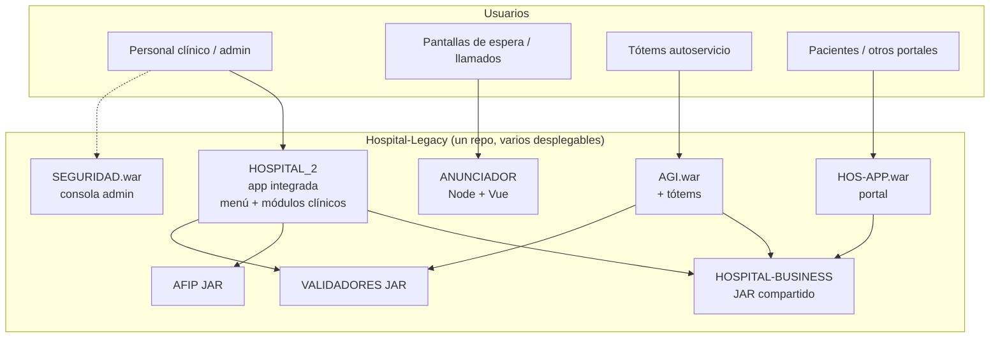
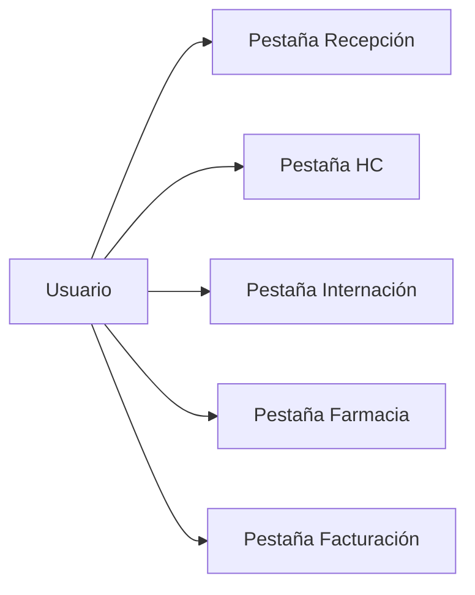
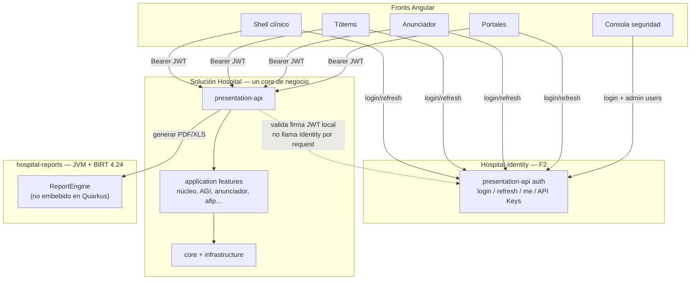
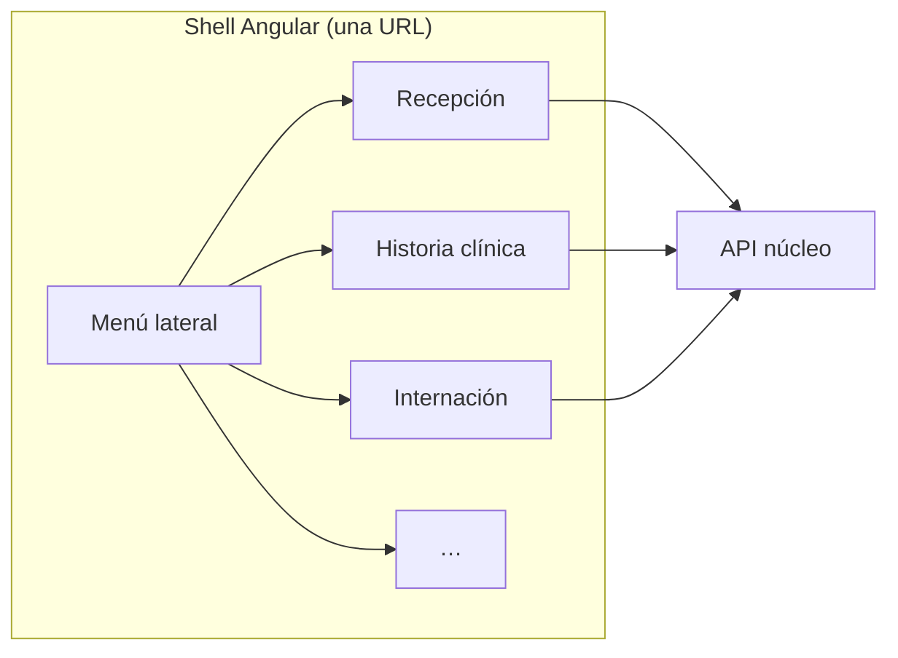

# Mapa legacy → productos destino (y la UX)

Respuesta a: *¿vamos a terminar con una pestaña por módulo?*  
**No necesariamente. Modularizar el backend no obliga a fragmentar la pantalla del usuario.**

---

## 1. Cómo está hoy (no es un solo WAR, pero sí una UX clínica integrada)

Hoy el personal clínico trabaja sobre todo en **HOSPITAL_2** (una app, un menú).  
AGI, ANUNCIADOR, HOS-APP y SEGURIDAD **ya son entradas distintas** (otro WAR/URL). La migración no inventa esa separación: ya existe para satélites.

---

## 2. Lo que *no* queremos

Eso sería un error de producto. **Nadie pidió eso.**  
Separar APIs Quarkus por dominio ≠ abrir una URL por dominio.

---

## 3. Modelo destino — **F2 ACORDADO 2026-08-13**

- **Una solución Hospital** para el negocio clínico (features en `application`).
- **Identity en repo/deploy aparte** (plataforma: login, refresh, users, API Keys).
- **Varios Angular** según dispositivo/audiencia, todos con el mismo JWT.

No es “un backend por módulo legacy”. Solo se separa **plataforma (Identity)** de
**dominio (Hospital)**. Análisis: [`analisis-identity-separado.md`](analisis-identity-separado.md).

### Lectura en una frase

- Login/refresh/escalado de auth → **Identity**.
- Lógica clínica / AGI / anunciador → **un** Hospital.
- Tótem u otra UI → front dedicado, **mismo** JWT y mismo API de negocio.
- Reportes PDF/XLS → **hospital-reports** (BIRT 4.24 en JVM aparte; ver [`birt-runtime-destino.md`](birt-runtime-destino.md)).

### Por qué las apps legacy separadas no dictan N backends clínicos

Muchas salieron del monolito por deuda tecnológica o por dispositivo. Eso se resuelve con
**features + fronts**, no con un microservicio por carpeta. Identity es la excepción
porque es plataforma reutilizable y carga de distinta calidad de servicio.

---

## 4. Mapa de lo que pediste migrar

| Origen legacy | Destino UX | Destino técnico |
|---------------|------------|-----------------|
| `HOSPITAL_2` / núcleo | Shell único | Features en **Hospital** |
| `HOSPITAL-BUSINESS`, `AFIP` | — | Absorbidos en Hospital |
| `AGI` + tótems | Angular tótem | Features en **Hospital**; auth → Identity |
| `ANUNCIADOR` | Angular anunciador | Features en **Hospital**; auth → Identity (reemplaza Node) |
| `HOS-APP` | Portal | Features en Hospital (cuando toque); auth → Identity |
| `SEGURIDAD` | Consola | UI cliente de **Identity** |
| BIRT (`.rptdesign` en WARs) | Download/impresión desde shell | **hospital-reports** (BIRT 4.24, proceso aparte) |
| Login Oracle / Node | Login único | **Hospital-Identity** |

## 5. Dos formas de armar el shell (elegir después; ambas evitan multi-pestaña)

| Opción | Idea | Cuándo |
|--------|------|--------|
| **A — Modular monolit front** | Un Angular, lazy routes por dominio (`/recepcion`, `/hc`, …), varias APIs detrás | Preferible al inicio: UX idéntica a HOSPITAL_2 |
| **B — Microfrontends** | Varios bundles montados en un shell con menú común | Solo si equipos/releases lo exigen; más complejo |

En ambos casos el usuario ve **una aplicación**. Identity solo autentica; no es otra pestaña de trabajo diario.

---

## 6. Qué implica para el piloto (AGI + ANUNCIADOR)

El piloto **sí** puede ser apps separadas sin romper al personal clínico:

- Hoy el tótem y el anunciador **no viven dentro del menú de HOSPITAL_2**.  
- Migrarlos aparte no saca al médico de su app integrada.  
- Sirven para estrenar Quarkus + Angular + Identity sin tocar todavía el monolito clínico.

Cuando migremos el núcleo (`HOSPITAL_2`), la regla de producto es:

> **Paridad UX:** el personal sigue entrando a *un* hospital digital, no a una suite de módulos sueltos.

**Look / acercamiento a PrimeFaces (California-Thinksoft):** no cerrado en F2 —
SDD [`docs/sdd/ux-shell-primefaces/`](../cortes/plataforma/ux-shell-primefaces/) (complejidad L2–L3;
no pixel xhtml).

---

## 7. Decisión de diseño — **ACORDADA 2026-08-13 (F2)**

1. **UX personal clínico:** un shell Angular.
2. **Negocio:** una solución Quarkus Hospital (features; no N APIs clínicas).
3. **Identity (F2):** repo y deploy **`Hospital-Identity`**, separado, reutilizable.
4. **Fronts satélite** (tótem, anunciador, portales, consola) según dispositivo; JWT de Identity; APIs de negocio en Hospital.
5. **No** un backend por carpeta legacy.
6. Más particiones de backend clínico = solo con evidencia posterior.

Dossier §5.7 · SDD plan § Repo destino · [`analisis-identity-separado.md`](analisis-identity-separado.md).

### Runtime de datos (acordado con dossier §6, 2026-08-13)

| Producto | Base |
|----------|------|
| `Hospital-Legacy` (JSF/PLSQL en prod hasta el corte) | Oracle **11.2** |
| `Hospital-Identity` / solución `Hospital` / fronts nuevos | **PostgreSQL** |
| Validación PL/SQL → Quarkus | Golden master en 11.2 (copia) → replay en Postgres |
| Go-live | UAT del nuevo **aislado** → **un corte** (sin unir al viejo) |

No se usa Oracle 19 como puente. No se apunta Hibernate Quarkus 3 al 11.2.
Análisis A/B/C (Postgres + corte vs Quarkus→19 vs solo upgrade legacy):
[`analisis-oracle19-vs-postgres.md`](analisis-oracle19-vs-postgres.md).
