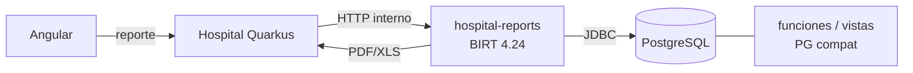

# Plan de migración: packages PL/SQL → Quarkus (CQRS)

`phase_id:` **`sdd.hospital.plan-migracion-packages-cqrs`**

Fecha: 2026-08-14  
Estado: **apoyo al plan A** (Quarkus 3 + PostgreSQL + golden master; Oracle 11.2 = oráculo)  
Complementa: [`dossier-migracion.md`](dossier-migracion.md) §5.5 / §6 / Fase 4 ·  
[`migracion-package-general.md`](migracion-package-general.md) ·  
[`birt-runtime-destino.md`](birt-runtime-destino.md) ·  
[`analisis-oracle19-vs-postgres.md`](analisis-oracle19-vs-postgres.md)

---

## 1. Propósito

Definir **cómo** bajar la lógica de packages Oracle al código Java del destino
(Hospital-Api / starter Quarkus: CQRS, handlers, repositories), sin confundir:

- el **package** (artefacto Oracle que mezcla reglas + SQL),
- el **Feature** CQRS (intención de negocio en la aplicación),
- el **oráculo** 11.2 (captura golden master),
- el **runtime** PostgreSQL (donde corre lo nuevo).

Este documento no reemplaza el dossier: es la guía operativa de corte y capas.

---

## 2. Glosario (términos del plan)

### 2.1 CU — Caso de uso

**CU** = caso de uso vertical: una pantalla, proceso o flujo completo que el hospital
ejecuta de punta a punta (ej. “recepción ambulatoria G1”, “confirmar parte quirúrgico”).

En este plan, el CU es la **unidad de migración y de Definition of Done**, no el
package. Un CU arrastra:

- N puntos de invocación PL/SQL (callables en `.hbm.xml`),
- tablas tocadas,
- eventuales reportes BIRT del flujo.

Ejemplo de ítem de backlog: `CU-xxx Registrar recepción` → Features
`RegisterXCommand` / `GetYQuery` + fixtures golden master.

### 2.2 `_hr` — wrappers Hibernate Result

Sufijo **`_hr`** en rutinas PL/SQL (ej. `f_is_quirofano_disponible_hr`). Son
**envoltorios** creados para que Hibernate legacy pueda invocar el package como
`<sql-query callable="true">` y mapear un cursor / `RESULT_SET` a un DTO
(`HibernateResult` u otro).

| Qué son | Qué no son |
|---------|------------|
| Adaptadores de **forma de retorno** hacia Hibernate | Lógica de negocio distinta de la rutina “real” |
| Ruido de la capa de persistencia antigua | Algo que haya que portar 1:1 a Quarkus |

En el destino **desaparecen**: el Handler/Query habla con repositorios o con APIs
Java tipadas; no hace falta un segundo entrypoint “para Hibernate”.

En `GENERAL`, el diseño ya cuenta **~14 envoltorios `_hr`** sin lógica propia
([`migracion-package-general.md`](migracion-package-general.md) §1 y §6).

### 2.3 WAIVER — excepción documentada al golden master

**WAIVER** = decisión explícita de **no** exigir paridad bit-a-bit (o de diferirla)
para un punto de invocación o caso borde, con:

- motivo (ej. bug legacy conocido que no se quiere reproducir; código muerto; reporte fantasma ORA-00904),
- dueño,
- riesgo aceptado,
- fecha / enlace a issue.

“Migrado” en el plan A implica **golden master PASS** **o** **WAIVER documentado**.
Sin uno de los dos, el callable no está cerrado.

No es un “skip silencioso” en el CI: es un artefacto de gobernanza.

### 2.4 Conversiones NLS

**NLS** = *National Language Support* de Oracle: parámetros de sesión/instancia que
afectan charset, fechas, números y ordenación (`NLS_CHARACTERSET`,
`NLS_DATE_LANGUAGE`, `NLS_NUMERIC_CHARACTERS`, etc.).

En este esquema (dossier §2.1):

| Parámetro | Valor legacy | Implicancia |
|-----------|--------------|-------------|
| `NLS_CHARACTERSET` | WE8MSWIN1252 | No es Latin-1; conversión a UTF-8 debe declarar Windows-1252 |
| `NLS_LENGTH_SEMANTICS` | BYTE | `VARCHAR2(n)` cuenta bytes; PG cuenta caracteres |
| `NLS_SORT` / `NLS_COMP` | BINARY | Sin semántica lingüística compleja |

Las **conversiones NLS** en packages (ej. `VARCHAR_TO_NUMBER` y similares en
`GENERAL`) existen porque PL/SQL necesita castear texto↔número/fecha **respetando
NLS**. En Java/`java.time` y en PostgreSQL UTF-8 **casi nunca se portan**: el tipo
correcto vive en el modelo; no se traduce el helper NLS.

Caso aparte: literales de fecha con `'NLS_DATE_LANGUAGE = ENGLISH'` dentro de
PL/SQL — al portar, fijar locale/formato en el dominio o en SQL PG de forma
explícita, no copiar el parámetro Oracle.

### 2.5 PG compat — capa de compatibilidad en PostgreSQL

**PG compat** = funciones (y a veces vistas) en **PostgreSQL** con **misma firma /
nombre esquemático** que consumen hoy:

- reportes BIRT (SQL embebido en `.rptdesign`),
- u otros consumidores que siguen hablando SQL de “estilo package”.

Objetivo: que BIRT (y SQL legado acotado) puedan apuntar a Postgres **sin reescribir
de golpe** cientos de diseños. No es el hogar permanente de reglas nuevas de
negocio: es un **puente de firma**.

**Retiro obligatorio:** cada función/vista PG compat nace con **CU de retiro** y
**fecha límite** (o criterio “consumidores residuales = 0”: ningún `.rptdesign` /
SQL externo la llama). Sin dueño de retiro, la capa bilingüe se vuelve permanente.
Inventario vivo de firmas compat; ver
[`sdd/ajustes-prioridad-migracion.md`](../planificacion/ajustes-prioridad-migracion.md) A1.

Diseño detallado para `GENERAL`:
[`migracion-package-general.md`](migracion-package-general.md) §5 capa 2.

Relación con Java:

- Cálculo puro → librería Java (fuente de verdad) + opcionalmente función PG que
  delega o duplica con GM.
- Solo BIRT → a menudo basta función PG validada con golden master.

### 2.6 Postgres para BIRT — cómo se maneja

Resumen operativo ([`birt-runtime-destino.md`](birt-runtime-destino.md)):

1. **BIRT no vive dentro de Quarkus** (ClassLoader / `javax.*` / no nativo). Corre en
   un proceso aparte (`hospital-reports`, BIRT 4.24, JDK 21 JVM).
2. Ese proceso abre **JDBC a PostgreSQL** (mismo cluster/schema que Hospital-Api).
3. Los `.rptdesign` se conservan; el trabajo duro es **SQL Oracle → SQL Postgres**
   y/o llamar funciones **PG compat** con firmas familiares (`ts.general.f_get_edad_anio`, etc.).
4. Hospital-Api pide el reporte por HTTP interno al sidecar; no embebe el engine.



Durante el build: el oráculo de paridad de esas funciones sigue siendo la **copia
Oracle 11.2** (golden master); el runtime de reportes del mundo nuevo es **solo PG**.

---

## 3. Principio de corte

| No hacer | Hacer |
|----------|-------|
| Migrar package completo como un Feature | Migrar por **CU** / punto de invocación |
| Apuntar Hibernate Quarkus a Oracle 11.2 | Capturar en 11.2 (JDBC); implementar en PG |
| Traducir body PL/SQL línea a línea al Handler | Clasificar rutina → Domain / Handler / Repository / PG compat |
| Esperar a “cerrar” un package cíclico | Avanzar CUs; el package se vacía por rutinas sin consumidores |

Hecho duro (dossier §5.5): **29 packages / ~84% del PL/SQL de negocio** forman un
ciclo. No existe orden de packages que cierre dependencias.

Excepciones que sí se atacan “casi como package” porque son **precondiciones**:

- `GENERAL` — libs + IDs + PG compat BIRT ([`migracion-package-general.md`](migracion-package-general.md))
- `SEGURIDAD` — hoja del grafo; Identity / autorización

---

## 4. Mapeo tipológico package → capas del starter

Un package mezcla lo que el starter separa. Clasificar **cada rutina** antes de codificar:

| Naturaleza de la rutina | Destino Quarkus / PG | Ejemplo |
|-------------------------|----------------------|---------|
| Cálculo puro (sin tablas) | Domain / lib compartida | edades, Interleaved 2/5, CUIT |
| Solo I/O (CRUD, lookup) | Repository (+ UoW) | lecturas/escrituras de entidad |
| Orquesta reglas + varias escrituras | **CommandHandler** (+ domain) | registrar atención, confirmar parte |
| Solo lectura para API/pantalla | **QueryHandler** (+ repo lectura) | obtener ocupación quirófano |
| Invocada desde BIRT / SQL externo | **PG compat** (± lib Java) | `f_get_edad_anio` en reportes |
| Wrapper `_hr` | No migrar | `f_*_hr` |
| Conversión NLS / truncate dinámico | No migrar o rediseñar | `VARCHAR_TO_NUMBER`, `p_truncate_table` |

### 4.1 Partir un procedimiento “gordo”

```text
PACKAGE.p_registrar_*(...)
  validaciones  ──► Domain policies / servicios de dominio
  lecturas      ──► Repositories (queries)
  next id       ──► secuencia PG / identidad de entidad
  inserts       ──► Repositories (commands de persistencia)
  orquestación  ──► CommandHandler (una intención = un Command)
```

El Handler **no** contiene SQL ni es un transliterado del body PL/SQL.

### 4.2 Layout orientativo (estilo starter)

```text
application/.../features/<bounded-context>/
  commands/<accion>/...Command.java
  commands/<accion>/...CommandHandler.java
  queries/<consulta>/...Query.java
  queries/<consulta>/...QueryHandler.java

domain/.../<contexto>/...Policies.java
domain/.../shared/EdadCalculator.java          # ex GENERAL puro

infrastructure/.../persistence/...RepositoryImpl.java

db/migration/ o sql/compat/                    # PG compat para BIRT
```

`GENERAL` **no** se modela como `features/general/` con Commands de negocio: es
infra de dominio compartida + IDs + compat SQL.

### 4.3 Cómo se consumen los IDs (`f_next_id_tabla`) en Quarkus

Esto **sí** entra en este plan (tipología §4 / ola 1), pero **no** como Feature CQRS
ni como port del `CustomIdGenerator` de Hibernate legacy.

| Legacy | Destino (plan A) |
|--------|------------------|
| `CustomIdGenerator` → `CALL ts.general.f_next_id_tabla(clase→TABLA)` en cada `@GeneratedValue` | El **CommandHandler / Adapter de persistencia del CU** pide el id **antes** del insert |
| Nombre de tabla derivado del nombre de clase Java | Nombre de tabla **explícito** (`"COLA_ESPERA_RECEP"`, `"TURNO"`, …) vía `NextIdService` / `InternacionIdService` |
| Package GENERAL como “servicio de IDs” invisible | Shared domain en `core/.../general/` (ya: V10/V13) |

```text
CommandHandler (CU)
  └─► reglas / elegibilidad / …
  └─► nextIdService.nextId("COLA_ESPERA_RECEP")   # o InternacionIdService
  └─► repository.insert(..., idAsignado)
```

**No hacer:** reintroducir un `IdentifierGenerator` global que adivine la tabla desde
el nombre de la entidad. **Sí hacer:** cada CU que persista una fila con PK legacy
opaca declara qué clave de `f_next_id_tabla` usa (mapa en
`next_id_registry.csv` / `sec_id_tabla`).

Implementación viva: [`sdd/spike-next-id-tabla/`](../spikes/spike-next-id-tabla/) ·
consumo piloto en G1 (`recepcion_agi.nro_espera` ← `COLA_ESPERA_RECEP`).

---

## 5. ¿Package como servicio invocado por handlers? ¿Es viable?

Pregunta del equipo: tratar el package como un **servicio** que los handlers
llaman (fachada 1:1 con el API del package).

### 5.1 Tres lecturas distintas (no mezclarlas)

| Lectura | Qué significa | ¿Viable? |
|---------|---------------|----------|
| **A. Servicio = JDBC al package Oracle 11.2** | Handler → `PersonasPackageService` → `CALL ts.PERSONAS...` | **No** como arquitectura del plan A (rompe destino PG; Quarkus 3 no es runtime de 11.2; atrasa la extracción) |
| **B. Servicio = fachada Java 1:1 del package** | `PersonasPackageService.f_get_persona_full(...)` con la misma superficie PL/SQL, implementada en Java/PG | **Transicional / acotada** — ver abajo |
| **C. Domain/Application service por capacidad** | Servicios pequeños (`EdadCalculator`, `PersonaLookup`) que **no** copian el boundary del package | **Sí** — alineado al starter |

### 5.2 Lectura B — fachada 1:1: pros, contras y veredicto

**Pros**

- Mapeo mental fácil para quien conoce PL/SQL.
- Permite mover callables de un CU sin rediseñar el modelo de dominio de golpe.
- Puede alojar golden master a nivel de “misma firma que el package”.

**Contras**

- **Recrea el monolito** y el **grafo cíclico** en Java (`CajasService` ↔ `FacturacionService`).
- Empuja a poner SQL dentro del “servicio de package” y dejar el Handler vacío
  (CQRS decorativo).
- Retrasa el bounded context real: el equipo sigue pensando en packages, no en CUs.
- Duplica API: el mundo nuevo debería hablar Commands/Queries, no `f_*` / `p_*`.

**Veredicto**

| Uso | Recomendación |
|-----|----------------|
| Spike / puente interno **temporal** mientras se porta un CU | Aceptable si el servicio es Java+PG, tiene dueño, fecha de retiro y **no** llama a Oracle |
| Forma estable de la arquitectura (“cada package = CDI service”) | **No recomendado** |
| Libs tipo `GENERAL` (cálculo puro) | Sí, pero como **shared domain**, no como “PackageGeneralService” eterno con 85 métodos públicos de negocio |

Patrón aceptable de transición:

```text
CommandHandler
    └─► (opcional, temporal) PackageFacade portada a Java
            └─► Domain + Repositories
```

Objetivo: el Facade **adelgaza** hasta desaparecer; el Handler habla Domain/Repos
directo. El Facade **nunca** es un cliente del package Oracle en prod del stack nuevo.

### 5.3 Lectura A — invocar PL/SQL desde el handler

Descartada como arquitectura (dossier §6.1 / §6.3). Solo spike excepcional JDBC a
11.2, fuera del UAT paralelo aislado, con plan de retiro.

---

## 6. Olas de planificación

### Ola 0 — Red de seguridad

- Harness golden master (formato, diff, PASS/WAIVE).
- Inventario CU ↔ callables ↔ tablas ↔ reportes.
- Catálogo tipológico por rutina (§4).

### Ola 1 — Precondiciones transversales

- `GENERAL`: libs Java + secuencias/IDs + PG compat BIRT top.
- `SEGURIDAD` / Identity.
- No son “Features de negocio” del Hospital clínico; son cimientos.

### Ola 2 — Piloto (calibrar velocidad)

- AGI + ANUNCIADOR: solo callables de esos CUs.
- Medir: rutinas/semana, % PASS, WAIVERs, esfuerzo real.

### Ola 3 — Núcleo por CU (Fase 4 del dossier)

- Orden por **uso hospitalario**, no por tamaño de package.
- Cada package grande se despieza a lo largo de muchos CUs.

### Ola 4 — Apagado de superficie PL/SQL

- Rutina sin consumidores en el mundo nuevo → retirada.
- No exigir “package 100% migrado” como hito único.

---

## 7. Plantilla de backlog (por CU)

```text
## CU-xxx  <nombre del caso de uso>

### Alcance
- Pantallas / APIs:
- Actores:

### Callables legacy (hbm / SQL)
| Callable | Package | Tipología (§4) | Destino | GM |
|----------|---------|----------------|---------|-----|
| f_...    | ...     | pura / I/O / orq / birt / _hr | Domain/Handler/Repo/PG/omitir | PASS\|WAIVE\|TODO |

### Features Quarkus
- Commands:
- Queries:

### Datos
- Tablas lectura/escritura:
- Secuencias / IDs:

### Reportes BIRT
- Diseños:
- Funciones PG compat necesarias:

### DoD
- [ ] Golden master PASS o WAIVER documentado por callable del CU
- [ ] Tests unitarios de domain
- [ ] IT del resource / smoke del CU
- [ ] Sin dependencia runtime a Oracle 11.2 en el stack nuevo
```

---

## 8. Checklist por Feature (sprint)

1. Elegir CU.
2. Listar callables y SQL nativo del flujo.
3. Clasificar tipología (§4).
4. Capturar golden master en copia 11.2.
5. Diseñar Commands/Queries (1 comando = 1 intención de escritura).
6. Extraer dominio puro (testeable sin BD).
7. Repositorios contra PostgreSQL.
8. PG compat solo si BIRT/SQL externo mantiene la firma.
9. Tests: unit + GM + IT.
10. DoD: PASS o WAIVER.

---

## 9. Anti-patrones

| Anti-patrón | Por qué |
|-------------|---------|
| Un Handler por package | Monolito PL/SQL en Java |
| SQL del package en el Handler | Rompe CQRS; reglas no testeables |
| `PackageService` → JDBC 11.2 | Puente eterno; no es plan A |
| Portar `_hr` y conversiones NLS | Ruido sin valor de dominio |
| Clonar `CustomIdGenerator` (tabla = nombre de clase) | Frágil; el CU debe nombrar la clave de secuencia explícita (§4.3) |
| Cerrar package entero antes del siguiente CU | Imposible por el ciclo |
| Dos fuentes de verdad (Java y PG) sin dueño | Elegir: lib Java + wrapper PG, o solo PG si es exclusivo BIRT |
| Facade 1:1 sin fecha de retiro | Se vuelve arquitectura por inercia |

---

## 10. Relación con otros documentos

| Tema | Documento |
|------|-----------|
| Estrategia global, dual-runtime, fases | [`dossier-migracion.md`](dossier-migracion.md) |
| Prioridades inmediatas / anti-patrones | [`sdd/ajustes-prioridad-migracion.md`](../planificacion/ajustes-prioridad-migracion.md) |
| Diseño `GENERAL` / IDs / BIRT helpers | [`migracion-package-general.md`](migracion-package-general.md) |
| Spike next-id (V10/V13 + consumo CU) | [`sdd/spike-next-id-tabla/`](../spikes/spike-next-id-tabla/) |
| Evidencia GM VPN | [`hallazgos-golden-master-vpn-2026-08-14.md`](hallazgos-golden-master-vpn-2026-08-14.md) |
| Sidecar BIRT + JDBC PG | [`birt-runtime-destino.md`](birt-runtime-destino.md) |
| A vs B vs C (motor) | [`analisis-oracle19-vs-postgres.md`](analisis-oracle19-vs-postgres.md) |
| CQRS del starter | starter Quarkus: `docs/architecture/ARQUITECTURA_QUARKUS_STARTER.md` |

---

## 11. Resumen ejecutivo

1. **CU** = unidad de migración; **package** = origen a despiezar.
2. Tipología de rutina decide Domain / Handler / Repository / **PG compat**.
3. **`_hr`**, conversiones **NLS** y borrados dinámicos: no portar (o rediseñar).
4. **WAIVER** = excepción gobernada al golden master.
5. **BIRT** → proceso aparte + JDBC a Postgres + funciones/vistas compat **con retiro**.
6. **Package como servicio**: viable solo como fachada Java **temporal** o como
   libs compartidas; **no** como cliente del PL/SQL ni como forma estable 1:1 del
   grafo de packages.
7. GTT / dual-datasource / TMP_* = fallback de un CU, **no** default transversal.
