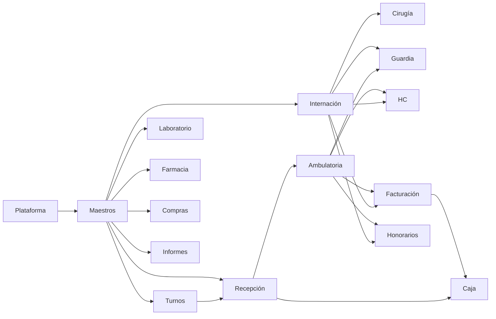

# Árbol de dependencias para el equipo

Unidad de trabajo = **stream** (módulo de menú + beans + package Oracle +
familia BIRT), **no** un xhtml. Arista = “no empezar B hasta que A escriba en
`ts`”. Canon paralelo: [`trabajo-paralelo-equipo.md`](../../planificacion/trabajo-paralelo-equipo.md).

3.347 xhtml / 2.510 beans / 329 reportes **no** se reparten 1:1: se agrupan en
**16 streams**. PERSONAS+GENERAL los llaman 153 y 142 diseños: son tronco.

## Alcance del cliente sobre este tablero (15-sep-2026)

Recorte y consecuencias: [`alcance-proyectos-migracion.md`](../../planificacion/alcance-proyectos-migracion.md).
Medido contra el índice del legacy, el resultado es **contraintuitivo y hay que decirlo**:

| | Java | XHTML | En menú |
|--|-----:|------:|--------:|
| **Dentro** (`HOSPITAL_2` · `HOSPITAL-BUSINESS` · `seguridad` · `AGI` · `HOS-APP` · `AFIP`) | 8.524 | 3.098 | 923 |
| **Fuera** (`SCHEDULER` · `VALIDADORES` · `RECETAS` · `WS-HOSPITAL` · `BIONEXO` · `ALFABETA`) | 579 | 49 | 1 |
| **Sin clasificar** (`ANMAT` · `AGH` · `AGP` · `PROVEEDORES` · `REVENG`) | 356 | 199 | 17 |

> **El recorte no achica el programa: saca el 6 % del código y el 1,5 % de las pantallas.**
> Los proyectos excluidos casi no tienen UI (cinco de los seis tienen **cero** `.xhtml`) y el
> 87 % del código vive en el monolito y en BUSINESS, ambos dentro. **Los 16 streams no
> cambian**, porque todos viven ahí.

Lo que el recorte sí cambia son tres cosas, y ninguna estaba en este tablero:

1. **Un carril nuevo: el disparador de procesos programados.** `SCHEDULER` afuera deja sin
   dueño la purga de la cola, el apagado del anunciador, la vigencia de habilitación y la
   confirmación/cancelación de turno por SMS
   ([`relevamiento-procesos-programados/`](../relevamiento-procesos-programados/README.md)).
   Afecta a Recepción, Turnos y al satélite Anunciador — los tres con gate cerrado.
2. **`seguridad` entra y no es ninguno de los 16 streams.** 51 `.xhtml`, 154 clases: perfiles,
   roles y menú por perfil. No es un stream de negocio: se absorbe en **Hospital-Identity** +
   un **Hospital-Identity-Web** nuevo
   ([`destino-seguridad-identity.md`](../../planificacion/destino-seguridad-identity.md)). Es el habilitante de
   [`regla-paridad-acceso-auditoria.md`](../../canon/regla-paridad-acceso-auditoria.md) y necesita
   owner propio.
3. **Laboratorio se agranda, no se achica.** Las interfaces de LIS, los autoanalizadores
   (ASTM sobre TCP y puerto serie) y PACS/DICOM viven en `HOSPITAL-BUSINESS`, **dentro** de
   alcance, y este tablero solo contaba las 83 hojas y el package. No están nombrados en
   ninguna de las dos listas del cliente: entran por arrastre, no por decisión.

Además, `VALIDADORES` afuera afecta a streams de adentro: la elegibilidad se invoca **desde
pantalla** en Recepción, Admisión y Turnos (P-ORA-010 en
[`pendientes-solo-oracle.md`](../../estado/pendientes-solo-oracle.md)). No es un stream que se cae: es
una dependencia externa de tres que siguen.

## DAG (izquierda = prerrequisito)

Verde cobrado · azul parcial · resto sin relevamiento A–C.

## Paquetes (asignables a un owner SDD)

Buscadores (~330 beans, 344 xhtml, 0 menú) viajan con el CU que los abre.

| Stream | Estado | Hojas | Beans | Líneas beans | Package / objeto | Reportes pkg | Depende | Paralelo |
|--------|--------|------:|------:|-------------:|------------------|-------------:|---------|----------|
| Plataforma | cobrado | 0 | 0 | 0 | Identity · `ts` · sidecar BIRT | 0 | — | Ya cobrada |
| Maestros | parcial | 232 | 562 | 121.306 | PERSONAS · GENERAL · centros/servicios · convenio CU-A | 153 | plat | Tronco: ABM chicos, no las 224 de una |
| Turnos | parcial | 42 | 40 | 25.626 | TURNOS (992 KB, 77 fn / 22 proc) | 7 | maestros | T6; no dos owners en `ts.turno` |
| Laboratorio | sin A–C | 83 | 143 | 59.198 | LABORATORIO (1.585 KB, 254 firmas) **+ interfaces LIS, autoanalizadores ASTM y PACS en BUSINESS** | 25 | maestros | Sí vs Turnos / Farm / Compras |
| **Seguridad** (nuevo: alcance 15-sep) | sin A–C | 51 (2 en menú) | 154 clases | — | Destino: **Hospital-Identity** + **Hospital-Identity-Web** ([`destino-seguridad-identity.md`](../../planificacion/destino-seguridad-identity.md)) | 0 | plat | Sí vs todos: nadie más escribe perfiles. Recurso disputado = Flyway de Identity (hoy V6) |
| Farmacia / Depósito | sin A–C | 111 | 141 | 53.922 | FARMACIAS (1.296 KB) | 3 | maestros | Sí vs Lab / Turnos / Compras |
| Compras | sin A–C | 54 | 96 | 46.790 | COMPRAS (613 KB) | 4 | maestros | Sí vs Lab / Farm |
| Recepción | parcial | 57 | 57 | 36.964 | RECEPCIONES (560 KB) | 5 | turnos, maestros | Cola B / gate; no writer clínico |
| Ambulatoria | sin A–C | 10 | 131 | 105.404 | ATENCION (1.233 KB) | 7 | maestros, recep | Menú subestima (2 hojas, 131 beans) |
| Internación / Admisión | sin A–C | 62 | 158 | 78.398 | ADMISION (310 KB) + UI internación | 30 | maestros | Sí vs Lab/Farm; **no** vs Guardia |
| Cirugía / Hx día | sin A–C | 59 | 78 | 30.844 | ADM_CIRUGIA (423 KB) | 0 | maestros, intern | Después de admisión camas |
| Guardia / GYE | sin A–C | 1 | 129 | 95.988 | Misma familia ATENCION/ADMISION | 0 | intern, amb | **No** simultáneo con Internación |
| Historia clínica | sin A–C | 2 | 5 | 7.403 | HISTORIA_CLINICA (25 reportes) | 25 | amb, intern | BIRT HC sí; UI HC no antes de atención |
| Informes / DxI | sin A–C | 32 | 32 | 17.468 | INFORMES | 3 | maestros | Sí vs Lab (interfaces aparte) |
| Facturación | sin A–C | 73 | 147 | 59.928 | FACTURACION + INTERNADO (1,7 MB) | 19 | amb, intern | No antes de writers clínicos |
| Honorarios | sin A–C | 35 | 76 | 19.889 | LIQUIDACION_HONORARIO (866 KB) | 0 | amb, intern | Tras prestaciones cerradas |
| Caja | sin A–C | 18 | 17 | 17.081 | CAJAS (755 KB) | 2 | fact, recep | Último ramal económico |

Módulos clínicos **subcontados por menú** (ej. Guardia 1 hoja vs 129 beans).

## Tablero — 16 streams × backlog (14-sep-2026)

SoT de **capacidad**. El picker de **esta semana** sigue siendo
[`backlog-orden-2026-08-14.md`](../../planificacion/backlog-orden-2026-08-14.md).
Circuitos de negocio (tiles): [`dependencias-modulos.md`](../relevamiento-his-orientacion/dependencias-modulos.md).
A–C por módulo: [`cobertura.md`](../relevamiento-his-orientacion/cobertura.md).

El inventario agrupa **16 streams HIS**. AGI / Anunciador / TV son **satélite**
(no tile origin); Nutrición tiene A–C T0 pero **no** es un stream propio: viaja
con Internación (ops N3–N5) + un ABM hijo de Maestros (hoja 11804).

### Esta semana (este workspace)

| # backlog | Corte | Stream | Qué **no** es |
|-----------|-------|--------|----------------|
| **✓** | M1a ABM `centro_atencion` — **gate-done** 2026-09-18 | Maestros | No es Lab ni T6 ni P3 C5 |
| **✓** | M1b servicio + `servicio_centro` — **gate-done** 2026-09-18 | Maestros | Tabs / auditoría diferidos; M1c **gate-done** |
| **✓** | M1c especialidad — **gate-done** 2026-09-18 | Maestros | Vínculo `especialidad_serv` diferido |
| **2** | Bootstrap padres (grp/provincia/paciente; **no** centro/servicio de esta oleada) | Maestros | No cierra ABM |
| **5** | E2E mostrador [`e2e-mostrador/`](../../cortes/recepcion/e2e-mostrador/) (AGI → Cola B → Llamar TV) | Recepción + satélite | No abre tile nuevo |
| **6** | Gate recepción + Cola B menú M5 | Recepción | Paralelo si no pisa `ts.turno` |
| **✓** | Llamar Cola B [`cola-b-llamar/`](../../cortes/recepcion/cola-b-llamar/) **gate-done** 2026-09-16 | Recepción | No es M5; no es Cola A |
| **✓** | Llamar atención médica [`cu-llamar-atencion-medica/`](../../cortes/recepcion/cu-llamar-atencion-medica/) **gate-done** 2026-09-16 | Ambulatoria | No es recepción ni M1 |
| **7** | R3.1 UAT impresora | Plataforma / BIRT | On-site; no bloquea E2E funcional |
| Diferido | Paciente-Web · P3 C5 smoke | portal · satélite | T6 vencidos es el owner Turnos; no mezclar con M1 |

**Código de módulo nuevo (Lab / Farm / Internación / Nutrición ops):** el backlog
lo deja **bloqueado** hasta cobrar E2E mostrador. A–C en docs (Coord) **sí** puede
arrancar en paralelo — no es “abrir vertical”.

Leyenda **esta semana:** `activo` · `paralelo-docs` · `bloqueado` · `idle` · `diferido`.  
**BODY:** `libre` · `reservado` (un owner; no segundo escritor) · `n/a`.

La columna BODY es un **lock que se consulta**, no una nota: al abrir un corte se reserva
aquí (BODY + rango Flyway + tablas que escribe) y se libera al cerrar — paso 2 de
[`loop-migracion-corte.md`](../../canon/loop-migracion-corte.md). Si está `reservado`, el corte no
arranca: se elige otra fila.

| Stream | A–C | BODY | Owner ahora | Próximo corte | Esta semana |
|--------|-----|------|-------------|---------------|-------------|
| Plataforma | n/a (cobrada) | n/a | — | UAT impresora R3.1; BIRT usados bajo demanda | idle (UAT on-site) |
| Maestros | **T0** [`relevamiento-maestros/`](../relevamiento-maestros/) | PERSONAS/GENERAL **on-demand** (M1a/M1b/M1c: n/a JDBC) | — | **M1a/M1b/M1c gate-done** · hijo [`maestros-m1c-especialidad-serv`](../../cortes/maestros/maestros-m1c-especialidad-serv/) | **idle** (tronco M1 cobrado) |
| Turnos | **T0** | n/a JDBC · writer `ts.turno` **liberado** | — | Historial, suspender, consulta, cola, sobreturno y múltiples de Equipo **gate-done** 2026-09-28. Cola: `consultaPreagenda` | libre |
| Laboratorio | no | LABORATORIO **libre** | — | A–C (Coord) → 1.er CU **después** E2E mostrador | `paralelo-docs` / código `bloqueado` |
| Farmacia / Depósito | no | FARMACIAS **libre** | — | A–C cuando Lab ya tiene owner de docs o código | `bloqueado` (código) |
| Compras | no | COMPRAS **libre** | — | A–C; paralelo vs Lab/Farm si tablas distintas | `idle` |
| Recepción | slices M1–M4 (no módulo) | RECEPCIONES **libre** (gate ≠ writer turno) | `e2e-mostrador` | [`paridad-recepcion-gate/`](../../cortes/recepcion/paridad-recepcion-gate/) (M5, después de P3) | **activo** (#5; 6b/6c **gate-done**) |
| Ambulatoria | no | ATENCION **libre** | — | hijos `cu-llamar-atencion-medica-ampliar` / `-norte` | 6c **gate-done**; no vertical |
| Internación / Admisión | no (Nutrición **T0** cuelga aquí) | ADMISION **libre** | — | A–C internación (Coord); Nutrición ops **después** censo | `paralelo-docs` / código `bloqueado` |
| Cirugía / Hx día | no | ADM_CIRUGIA **libre** | — | Tras admisión camas | `idle` |
| Guardia / GYE | no | ATENCION/ADMISION — **no** vs Internación | — | No simultáneo con internación | `idle` |
| Historia clínica | no | HISTORIA_CLINICA (BIRT 25) | — | BIRT R5 scaffold; UI HC no antes de atención | BIRT `idle` (bajo demanda) |
| Informes / DxI | no | INFORMES **libre** | — | A–C; paralelo vs Lab (interfaces aparte) | `idle` |
| Facturación | no | FACTURACION **libre** | — | No antes de writers clínicos; BIRT Recibo/Factura = 3.er dominio | `idle` |
| Honorarios | no | LIQUIDACION_HONORARIO **libre** | — | Tras prestaciones cerradas | `idle` |
| Caja | no | CAJAS **libre** | — | Último ramal económico | `idle` |
| **Seguridad** | no | Flyway Identity (V6) **libre** | — | A–C del modelo (4 sujetos, 2 niveles de perfil) → emisor de claims `menu:KEY` en Identity | `idle` (sin owner) |

### Satélites (fuera de los 16 tiles)

| Pieza | A–C | Owner ahora | Próximo corte | Esta semana |
|-------|-----|-------------|---------------|-------------|
| AGI + Anunciador + TV | **sí** ([`relevamiento-node-anunciador/`](../relevamiento-node-anunciador/)) | P3 C5 `diferido(anunciador-agi-config-abm-c5)` | display TV pendiente | **diferido** (C5) |
| Hospital-Reports | motor cobrado; 37/231 usados | Dev 3 cuando se asigne | Hits: lab / factura / internación; no huérfanos | bajo demanda (#9) |
| Paciente-Web | no (capa 3 antes de spec) | — | No extraer de Hospital-Web | **diferido** (y `AGP` quedó **sin clasificar** en el recorte: contradicción a resolver) |
| **Disparador de procesos programados** | sí ([`relevamiento-procesos-programados/`](../relevamiento-procesos-programados/README.md)) | **sin owner** | Consulta a `ts.tarea_programada`; decidir quién porta las 4 capacidades sin pantalla | **bloqueado** (falta firma de producto) |

Origin con A–C de negocio: **Turnos + Nutrición + Administración General** (3/37). El cuarto es el
**satélite** Anunciador. No citar Anunciador como tile origin. Dueño de la cifra:
[`datos-canonicos.md`](../../canon/datos-canonicos.md).

## Tronco compartido (no asignar entero)

| Objeto | Quién lo usa | Regla |
|--------|----------------|-------|
| PERSONAS + GENERAL | 153 y 142 `.rptdesign`; casi todos los beans | Port on-demand por firma. Dueño = plataforma/Reports |
| `pages/configuracion` (224 hojas, 562 beans) | Todos los módulos | Cortar ABM (centro, servicio, convenio, personal) como SDD hijos |
| `pages/buscadores` (344 xhtml, 0 menú) | Agenda, recepción, HC… | Viajan con el CU (T5.1: paciente) |
| schema `ts` / Flyway | Api + Reports | Un escritor de migración por sprint; contrato en SDD |

## Qué sí / qué no en paralelo

**Sí**

| Stream A | Stream B | Por qué |
|----------|----------|---------|
| Turnos T6 / sync Web | Laboratorio (A–C + 1.er CU) | Packages distintos |
| Laboratorio | Farmacia / Depósito | LABORATORIO vs FARMACIAS |
| Compras | Lab o Farmacia | COMPRAS aislado |
| BIRT dominio X | UI dominio Y | Si no tocan el mismo Flyway |
| Recepción gate / Cola B | BIRT facturación o lab | UI vs print-path |
| Informes / DxI | Compras | Sin writer clínico compartido |

**No**

| A | B | Choque |
|---|---|--------|
| Internación | Guardia | Mismo ATENCION/ADMISION |
| Ambulatoria writer | Facturación | Factura lee prestación |
| Turnos | Recepción writer | OTORGADO → RECEPCIONADO |
| Dos Flyway en `ts.turno` | Cualquiera | Pisan Vnn |
| Dos cortes BIRT mismo BODY | — | Ports duplicados / SQL drift |
| Maestros 224 hojas | Otro maestro | Un ABM a la vez |

BIRT **no** bloquea módulos: el sidecar ya está. Cada reporte se engancha al
package de su dominio. Owner BIRT toma un stream que **nadie** esté portando
en Api esa semana (Lab 25, Internación 30, Facturación 19, HC 25 reportes pkg).

## Reparto sugerido (4 personas)

Un CU de Api+Web por vez por repo. El cuarto carril es BIRT **o** relevamiento
A–C (docs, sin codear encima).

**Override 14-sep (este workspace):** no somos Dev 2 de Lab. Carril = P3
satélite + no pisar owner Turnos. El cuadro de abajo es capacidad de equipo
cuando hay 4 heads; el tablero de arriba dice qué está **activo** hoy.

| Rol | Stream ahora | Objetos | No toca |
|-----|----------------|---------|---------|
| Dev 1 — UI/API | Turnos resto (T6 + sync clone) o Recepción-gate | beans turnos/recepcion · TURNOS/RECEPCIONES · agenda.xhtml | `ts.ord_lab_pac`, FARMACIAS, Flyway lab |
| Dev 2 — UI/API | Laboratorio (A–C → primer CU) | 143 beans · 83 hojas · LABORATORIO_BODY · 25 reportes lab | `ts.turno`, ATENCION writer |
| Dev 3 — BIRT | 3.er dominio (Factura/Recibo o Partograma) | `.rptdesign` + packages-pg de **ese** BODY · JSON · `target/preview` | Hospital-Web; mismo BODY que Dev 2 |
| Coord / Dev 4 | A–C Farmacia o Internación | `docs/sdd/relevamiento-*` | PRs de implementación encima de Dev 1–2 |

Si crece a 6: Dev 5 Farmacia (111 hojas) cuando Lab ya tiene owner; Dev 6 Compras
si no comparte tablas con Farm.

### Cómo asignar el próximo paquete

1. ¿Tiene relevamiento A–C? Si no, Coord **antes** de código.
2. ¿El BODY está libre (nadie portando firmas)?
3. ¿Flyway toca tablas de otro owner?
4. Recién entonces `docs/sdd/<slug>/` con un owner.

## Cómo usar el inventario para planificar

0. Confirmar que el stream está **dentro de alcance** (§ alcance del cliente): un corte de
   un proyecto excluido no se abre, y una capacidad de proyecto excluido que sostiene un
   stream de adentro se declara como carril propio, no como parte del corte.
1. Leer el **tablero** de esta página (capacidad + BODY + A–C).
2. Elegir la fila de **esta semana** en el backlog — no un xhtml ni un % HIS.
3. **BIRT:** listado por caller (~194), no 329 archivos. Priorizar hits:
   laboratorio, facturación, internación (Partograma, InformePac, Recibo).
4. **UI:** no abrir módulo sin A–C. Siguiente grande por pantalla (cuando el
   backlog deje de bloquear vertical nueva): laboratorio / farmacia / ambulatoria.
5. **Packages:** cuando un `.rptdesign` o un CU los llama. LABORATORIO_BODY
   (32 k líneas) es el objeto más caro del SoT.
6. Reconciliar Web/API con el SDD de Turnos **antes** de tratar T5.4-b como
   código entregable en un clone de agosto.
